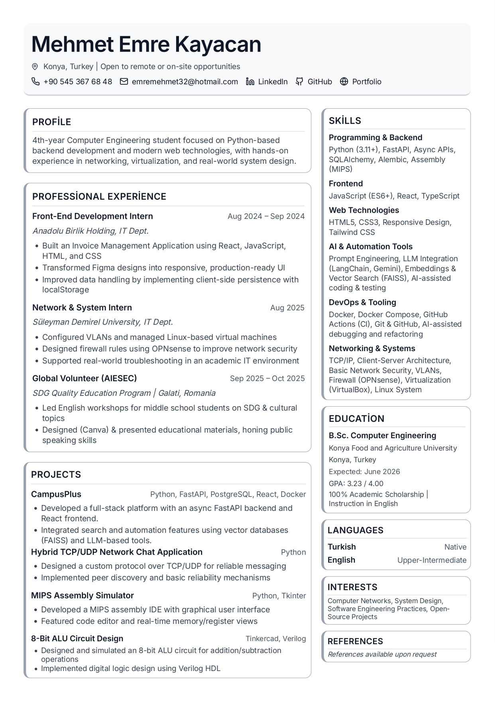
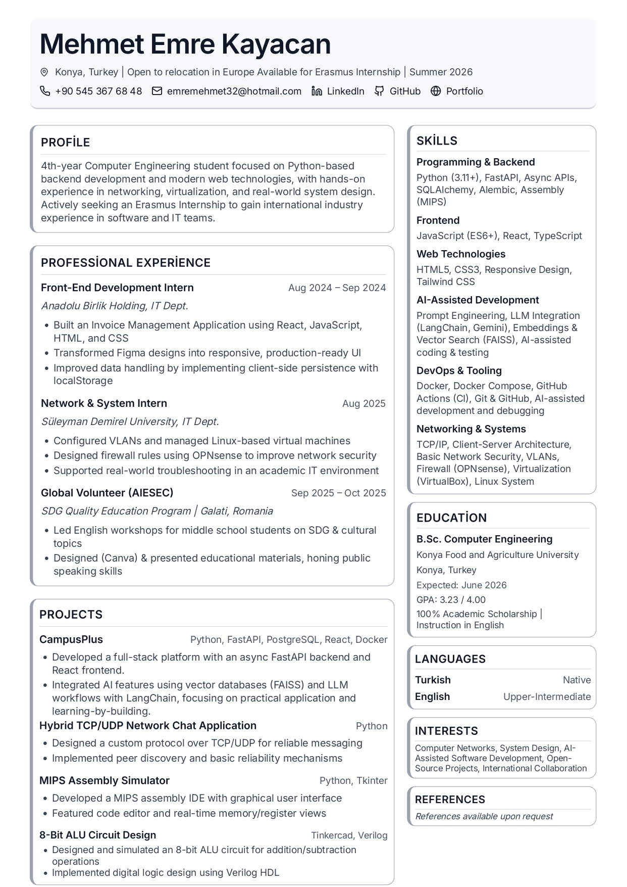

# 📄 Interactive CV Application

<div align="center">
  
  
  
  
  
  
  **Modern, interactive CV application with dual CV support**
  
</div>

---

## 🌟 Features

- **📋 Dual CV Support** - Switch between Standard CV and Erasmus CV formats
- **🎨 Modern UI** - Clean, professional design with TailwindCSS
- **📱 Responsive Design** - Optimized for all screen sizes
- **🖨️ Print-Ready** - Perfect print layouts for PDF export
- **⚡ Lightning Fast** - Built with Vite for optimal performance
- **🎯 Type-Safe** - Fully typed with TypeScript
- **🎭 Component Library** - Rich UI components from Radix UI & shadcn/ui

## 📸 CV Previews

### Standard CV
<p align="center">
   
</p>

### Erasmus CV
<p align="center">
   
</p>

## 🚀 Quick Start

### Prerequisites

- Node.js (v18 or higher)
- npm or yarn

### Installation

1. **Clone the repository**
   ```bash
   git clone https://github.com/mehmetemrekayacan/interactive-cv.git
   cd interactive-cv
   ```

2. **Install dependencies**
   ```bash
   npm install
   ```

3. **Start development server**
   ```bash
   npm run dev
   ```

4. **Open your browser**
   ```
   Navigate to http://localhost:5173
   ```

## 🏗️ Built With

### Core Technologies
- **React 19.0.0** - UI Framework
- **TypeScript** - Type Safety
- **Vite** - Build Tool
- **TailwindCSS** - Styling

### UI Components
- **Radix UI** - Accessible component primitives
- **shadcn/ui** - Beautifully designed components
- **Material-UI** - Additional UI components
- **Lucide React** - Icon library
- **Framer Motion** - Animations

### Additional Libraries
- **date-fns** - Date manipulation
- **clsx & tailwind-merge** - Conditional styling
- **embla-carousel** - Carousel functionality

## 📂 Project Structure

```
cv/
├── src/
│   ├── app/
│   │   ├── components/
│   │   │   ├── CV.tsx                 # Standard CV component
│   │   │   ├── ErasmusCV.tsx         # Erasmus CV component
│   │   │   ├── figma/                # Figma-exported components
│   │   │   └── ui/                   # Reusable UI components
│   │   └── App.tsx                   # Main application
│   ├── styles/                       # Global styles
│   └── main.tsx                      # Application entry point
├── public/                           # Static assets
├── guidelines/                       # Project guidelines
└── package.json                      # Dependencies
```

## 🎨 Features in Detail

### CV Switcher
Toggle between two different CV formats:
- **Standard CV**: Traditional format for general applications
- **Erasmus CV**: Specialized format for Erasmus internship applications

### Print Optimization
The application is optimized for printing:
- Print button in the interface
- Clean print styles without UI clutter
- Professional PDF output

### Responsive Design
Works seamlessly across devices:
- Desktop browsers
- Tablets
- Mobile devices

## 🛠️ Development

### Available Scripts

```bash
# Start development server
npm run dev

# Build for production
npm run build

# Preview production build
npm run preview
```

### Building for Production

```bash
npm run build
```

This will create an optimized production build in the `dist` folder.

## 📝 Customization

### Updating CV Content

1. Edit the CV components:
   - Standard CV: `src/app/components/CV.tsx`
   - Erasmus CV: `src/app/components/ErasmusCV.tsx`

2. Modify styles in:
   - `src/styles/tailwind.css` - Tailwind configuration
   - `src/styles/theme.css` - Theme variables
   - `src/styles/fonts.css` - Font styles

### Adding New Components

The project uses shadcn/ui components. Add new components:

```bash
npx shadcn-ui@latest add [component-name]
```

## 🎯 Use Cases

- **Job Applications** - Present your CV in a modern, interactive format
- **Portfolio Website** - Embed as part of your personal portfolio
- **Erasmus Applications** - Specialized CV format for international opportunities
- **PDF Generation** - Export professional PDFs directly from the browser

## 📄 License

This project is open source and available under the MIT License.

## 👤 Author

**Mehmet Emre Kayacan**

<div align="center">
  
  ### 🌐 Connect with me:
  
  [](https://www.linkedin.com/in/mehmet-emre-kayacan-5a4556254/)
  [](https://github.com/mehmetemrekayacan)
  [](https://mehmet-emre-portfolio.netlify.app/)
  [](mailto:emremehmet32@hotmail.com)
  
</div>

## 🤝 Contributing

Contributions, issues, and feature requests are welcome!

1. Fork the project
2. Create your feature branch (`git checkout -b feature/AmazingFeature`)
3. Commit your changes (`git commit -m 'Add some AmazingFeature'`)
4. Push to the branch (`git push origin feature/AmazingFeature`)
5. Open a Pull Request

## ⭐ Show your support

Give a ⭐️ if this project helped you!

---

<div align="center">
  Made with ❤️ by Mehmet Emre Kayacan
</div>
